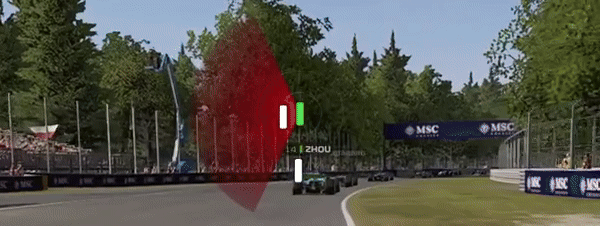

# F1InputTelemetry

F1InputTelemetry is a lightweight real-time overlay suite for the F1 games from 2018 to 2025. It captures UDP telemetry data from the game and displays comprehensive in-game information including your throttle, brake, clutch, and steering inputs, as well as a race radar showing nearby cars.

### Input Telemetry

  

### Race Radar

  

## Features

*   **Real-time Input Display:** Instantly visualize your throttle, brake, clutch, and steering inputs.
*   **Telemetry Graph:** A line graph shows your throttle and brake history for quick analysis.
*   **Race Radar:** A radar overlay that displays the position and distance of nearby cars in real-time. See which cars are around you and detect close proximity threats.
*   **Customizable Overlays:** Adjust the position and scale of both the input telemetry and radar overlays via `settings.yaml` file.
*   **Auto-Hide:** Optionally, the overlays can automatically hide when not in a session and appear when a session starts.
*   **Spectator Support:** Automatically switches to display the telemetry data and radar of the car you are spectating.

## Installation and Usage

1.  **Download:** Go to the [**Releases page**](https://github.com/4nder123/F1InputTelemetry/releases) and download the latest `F1InputTelemetry.exe` file.
2.  **Run:** Place the `.exe` in a folder of your choice and run it. A `settings.yaml` file will be created in the same directory.
3.  **Play:** The overlays will now appear and display information while you are in a session. You can customize the application by editing the `settings.yaml` file (close and restart the application for changes to take effect).

> ⚠️ **Important:**   
> - UDP telemetry needs to be enabled in your game's telemetry settings.
> - The game cannot be in fullscreen mode. It must be in **windowed borderless mode** for the overlay to display correctly.
> - If you change or have changed the **IP address, port, or send rate** in your game's telemetry settings, you must also update those same values in the `settings.yaml` file to ensure the overlay works correctly. 

### Moving the Overlays
Press and hold **Ctrl + Left Shift** to enable move mode. While holding this key combination, you can drag the overlays to new positions on your screen. Release the keys to disable move mode. The new positions are automatically saved to the `settings.yaml` file.

## Configuration

The application is configured by editing the `settings.yaml` file that is generated on the first run.

### Network & Telemetry

| Parameter | Description | Default |
| :--- | :--- | :--- |
| `IPAddress` | The IP address to listen on for UDP telemetry data. | `127.0.0.1` |
| `Port` | The UDP port to listen on. | `20777` |
| `SendRate` | The telemetry send rate from the game (e.g., 20 Hz). | `20` |

### Input Telemetry Overlay

| Parameter | Description | Default |
| :--- | :--- | :--- |
| `Enabled` | If `true`, the input telemetry overlay is displayed. | `true` |
| `WindowX` | The horizontal screen coordinate for the center of the overlay. | `960` |
| `WindowY` | The vertical screen coordinate for the center of the overlay. | `815` |
| `WindowScale` | A multiplier to scale the size of the overlay. `1.0` is 100%. | `1.0` |
| `AutoHide` | If `true`, the input telemetry overlay only appears when an in-game session is active. | `false` |
| `ShowClutch` | If `true`, the clutch input bar is displayed. | `true` |

### Radar Overlay

| Parameter | Description | Default |
| :--- | :--- | :--- |
| `Enabled` | If `true`, the race radar overlay is displayed. | `false` |
| `WindowX` | The horizontal screen coordinate for the center of the overlay. | `960` |
| `WindowY` | The vertical screen coordinate for the center of the overlay. | `315` |
| `WindowScale` | A multiplier to scale the size of the overlay. `1.0` is 100%. | `1.0` |

## License

This project is licensed under the MIT License. See the `LICENSE.txt` file for details.
